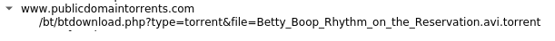

# Network Forensic Analysis Report

## Time Thieves 
You must inspect your traffic capture to answer the following questions:

1. What is the domain name of the users' custom site?

    `frank-n-ted.com`

2. What is the IP address of the Domain Controller (DC) of the AD network?

    `10.6.12.12`

3. What is the name of the malware downloaded to the 10.6.12.203 machine?

    `June11.dll`
   - Once you have found the file, export it to your Kali machine's desktop.
4. Upload the file to [VirusTotal.com](https://www.virustotal.com/gui/).

5. What kind of malware is this classified as?

    `This is classified as a Trojan`

---

## Vulnerable Windows Machine

1. Find the following information about the infected Windows machine:
    - Host name: `Laptop-5WKHX9YG`
    - IP address: `10.6.12.203`
    - MAC address: `84:3a:46:6d:fc:e2`
    
2. What is the username of the Windows user whose computer is infected?

    `Frank Brokowski`

3. What are the IP addresses used in the actual infection traffic?
    
    `205.185.125.104`

    `5.101.51.151`

4. As a bonus, retrieve the desktop background of the Windows host.

---

## Illegal Downloads

1. Find the following information about the machine with IP address `10.0.0.201`:
    - MAC address: `00:16:17:18:66:c8`
    - Windows username: `Blanco`
    - OS version: `Windows NT`

2. Which torrent file did the user download?
`Betty_Boop_Rhythm_on_the_Reservation.avi.torrent`
