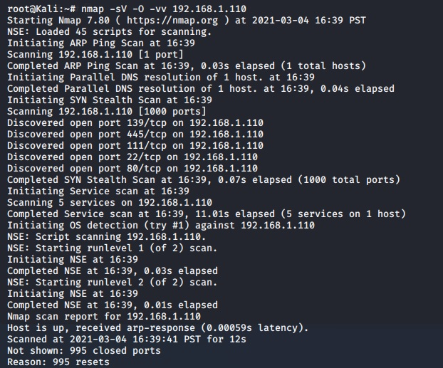
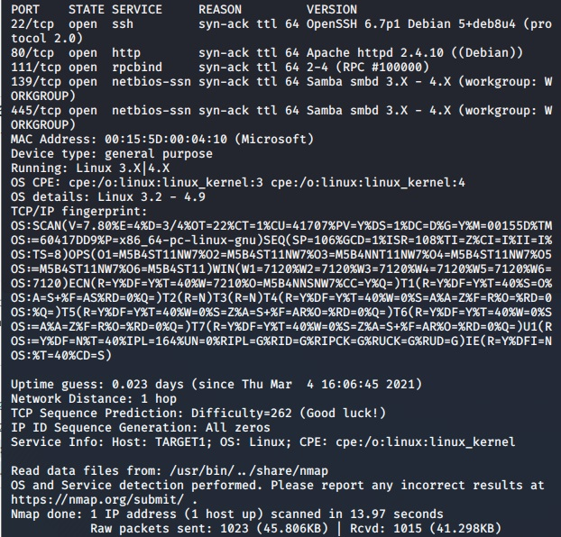
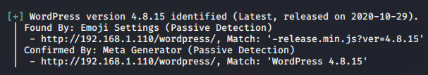
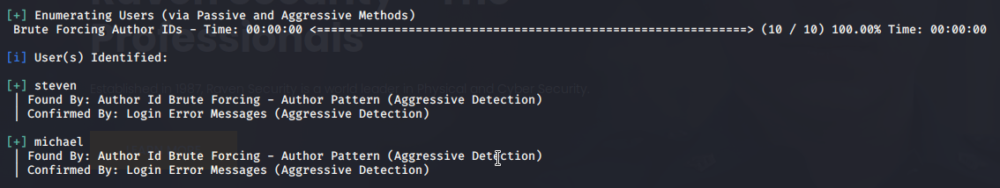
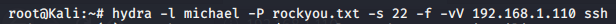
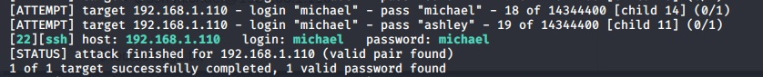
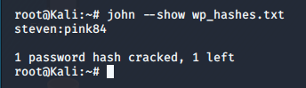
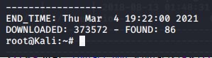
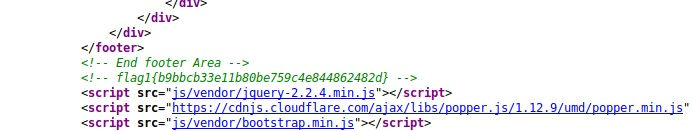
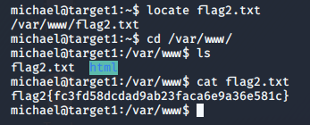

# Red Team: Summary of Operations

## Table of Contents
- Exposed Services
- Critical Vulnerabilities
- Exploitation

### Exposed Services
_TODO: Fill out the information below._

Nmap scan results for each machine reveal the below services and OS details:

```bash
nmap -sV -O -vv 192.168.1.110
#Scan revealed:
```




This scan identifies the services below as potential points of entry:
- Target 1
  - Port 22/tcp - ssh - Open
  - Port 80/tcp - http - Open
  - Port 111/tcp - rbcbind - Open
  - Port 139/tcp - netbios-ssn - Open
  - Port 445/tcp - netbios-ssn - Open

#### Port 22
An open port 22 can allow ssh logins. Keeping port 22 open usually welcomes attackers to brute force using a dictionary attack. 

#### Port 80
Port 80 allows for HTTP traffic. Attackers can also use brute force and dictionary attacks to gain access.

#### Port 111
Port 111 allows attackers to see what services are running. This can be used for reconnaissance activity. The RPC Service has a history of security vulnerabilities.

#### Port 139 & 445
These ports allow for network file sharing. Also allow the potential of a possible reverse shell via Metasploit. 


_TODO: Fill out the list below. Include severity, and CVE numbers, if possible._

The following vulnerabilities were identified on each target:
### Target 1
#### WP Scan
- By knowing that Raven Security is running Wordpress I ran a wpscan to enumerate the version and its users. By gaining this information I could see if their version of word press is vulnerable to attacks as well as gain user information. 
- Raven Security is running Wordpress version 4.8.15 - this version is susceptible to numerous vulnerabilities:
https://www.cvedetails.com/vulnerability-list/vendor_id-2337/product_id-4096/ 

- By running Wordpress Raven Security also allowed me to view users. I found two users for Raven Security: Michael and Steven


#### Brute Force Attack:
- The first Brute Force attack I ran was to gain Michael's password. By running a simple Hydra command I was able to easily and successfully gain Michael's password.
hydra -l michael -P rockyou.txt -s 22 -f -vV 192.168.1.110 ssh



- The second Brute Force attack I ran was to gain Steven's password.  Although this came later on, I used John the Ripper to crack Steven's password hash. The password hash was gained when I managed to pull up the wordpress sql database.



#### Spawning a TTY Shell
- After gaining access back into the system as Steven I attempted to spawn a TTY Shell using a python command. By using this command I gained root access on the system:
```
sudo python -c 'import pty; pty.spawn("/bin/sh")'
```

#### Information Disclosure Issues:
- There can be many different types of Information Disclosure issues in web applications. These can be common mistakes that developers or make that can lead to the discovery of confidential and sensitive information. From Banner Grabbing to File Path Disclosure, attackers can utilize the web page itself to discover "hidden" information. The specific Information Disclosure Vulnerability used for this attack involved "Inappropriate Handling of Sensitive Data." For this I ran a simple, View Page Source, and started analyzing the data. Since I knew specifically what I was looking for I was able to run a find command on each page to gather my information.  

#### Directory Indexing:
Directory Indexing or Directory Browsing can lead to exposing directory listings on a site that a company may not want you to know about. By running a dirb command in Kali an attacker could find other hidden files.



_TODO: Include vulnerability scan results to prove the identified vulnerabilities._
### Exploitation
_TODO: Fill out the details below. Include screenshots where possible._

The Red Team was able to penetrate `Target 1` and retrieve the following confidential data:
### Target 1
### Flag1.txt: Hash Value:
`flag1{b9bbcb33e11b80be759c4e844862482d}`




**Exploit Used:**
`Information Disclosure Issue`
  - By right clicking on the web page, I went to: ```View Page Source.```  From here I started to inspect the page and see if anything stood out. I did a search through the various folders and found flag1 in the service.html folder.

### Flag2.txt: Hash Value:
`flag2{fc3fd58dcdad9ab23faca6e9a36e581c}`

**Exploit Used:**
`Brute Force Attack`
  - By running a Brute Force Attack against Michael's username we managed to uncover his "secret" password. As noted above, Michael's password turned out to be his name: michael

    ```
    hydra -l michael -P rockyou.txt -s 22 -f -vV 192.168.1.110 ssh
    ```

  - By then doing a ssh into the IP we can successfully log in as Michael: 
    
    ```
    ssh michael@192.168.1.110 -p 22
    password: michael
    ```
  - Now that we are logged in as Michael we can begin the search for the Flag. Since the first flag was labeled with a .txt let's begin our search with that.
    ```
    locate flag2.txt
    ```
    - As seen in the screenshot - this directs us to the /var/www/ folder where Flag2 is hiding.



